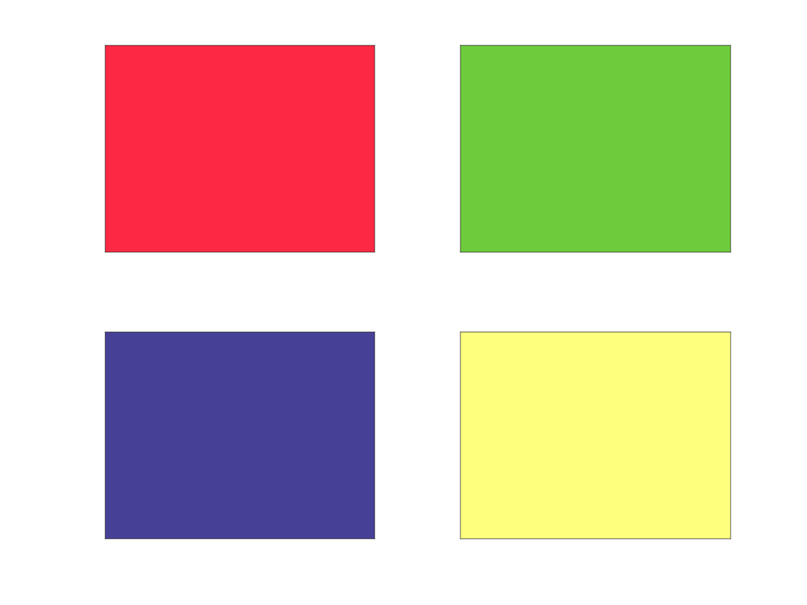

RGB Colorname Package
=====================

Here we provide methods to retrieve rgb triplets, from two huge well-known datasets: the old Unix [X11/rgb.txt](https://en.wikipedia.org/wiki/X11_color_names) file and the impressive web-survey carried out by [xkcd](https://xkcd.com/color/rgb/). There is no bias here between the two (contrary to what happens in [matplotlib, which prioritizes X11 names](https://matplotlib.org/stable/tutorials/colors/colors.html#comparison-between-x11-css4-and-xkcd-colors)), as you can invoke respectively `rgb.X11('colorname')` and `rgb.xkcd('colorname')` to get colors from either the datasets. Both functions share the same API:

1. Both `rgb.X11('show')` and `rgb.xkcd('show')` will pop-up an html chart with all colors depicted, in window-based environments. On terminal it will just print all the colornames.
   
2. For whatever input other than `'show'` a powerful string-search engine will scan the selected database and either return the rgb triplet, for exact, case-insentive matches, or provide a list of 'nearest' (in string space!) matches. Try it, you'll find that the 'show' option is quite unuseful at the end of the day. 🙃

    ```matlab
    !EXAMPLE
    rgb.xkcd('blue-green')
    Color 'blue-green' not found in xkcd/rgb.
    Consider one of these options:
        {'greenblue' }
        {'bluegreen' }
        {'green/blue'}
        {'blue/green'}
        {'green blue'}
        {'blue green'}
    ```
   
3. Both functions accept not only single characater vectors, but also strings, cells of strings, multiple strings / character vectors. It's as general as possible: whatever valid collection of colornames should work fine.

For more detailed information and examples just invoke the docstrings by typing `help rgb.X11`, `help rgb.xkcd` (or use the `doc` command instead of `help` for a nicer pop-up window).

## Additional interactive funtionaity through `rgb.view`

To help interactive exploration we furthermore provide a very simple --yet effective-- tool to visualize small collections of colors, so to allow fast visual comparisons and easier overall evaluation of different colornames. It supports single or multiple colors (as cells, not multiple arguments allowed, currently) and an optional string to specify the visual format of the shown palette: `'squares'` for a matrix, `'hbars'` and `'vbars'` for respectively horizonatal and vertical barplots. It supports colornames from _both_ the X11 and xkcd datasets, prioritizing the latter when there is collision: learn more about our naming criteria in the docstrings of [`str2rgb`](../colortools/str2rgb.m), our higher level wrapper for colorname-to-rgb-triplet conversions, which includes also other smaller sets and provide a hex-to-rgb converter.

Some examples:

```matlab
rgb.view({'r','g','b','c','m','y','k','w'},'squares')
rgb.view({'strawberry','apple','blueberry',"banana"})
rgb.view({'matlab1','matlab2','matlab3','matlab4'},'hbars')
rgb.view({'pyplot1',"pyplot2",'pyplot3'},'vbars')
```
would produce the following (_clockwise_ ordering):

 | 
--|--
 | 

### COPYRIGHT & LICENSING ###

© 2014 Chad Greene, original [rgb function](https://it.mathworks.com/matlabcentral/fileexchange/46872-intuitive-rgb-color-values-from-xkcd)    
© 2022 Gabriele Bellomia, rgb.X11 adaptation    
All rights reserved.    

Redistribution and use in source and binary forms, with or without
modification, are permitted provided that the following conditions are
met:

  * Redistributions of source code must retain the above copyright
    notice, this list of conditions and the following disclaimer.
  * Redistributions in binary form must reproduce the above copyright
    notice, this list of conditions and the following disclaimer in
    the documentation and/or other materials provided with the distribution

THIS SOFTWARE IS PROVIDED BY THE COPYRIGHT HOLDERS AND CONTRIBUTORS "AS IS"
AND ANY EXPRESS OR IMPLIED WARRANTIES, INCLUDING, BUT NOT LIMITED TO, THE
IMPLIED WARRANTIES OF MERCHANTABILITY AND FITNESS FOR A PARTICULAR PURPOSE
ARE DISCLAIMED. IN NO EVENT SHALL THE COPYRIGHT OWNER OR CONTRIBUTORS BE
LIABLE FOR ANY DIRECT, INDIRECT, INCIDENTAL, SPECIAL, EXEMPLARY, OR
CONSEQUENTIAL DAMAGES (INCLUDING, BUT NOT LIMITED TO, PROCUREMENT OF
SUBSTITUTE GOODS OR SERVICES; LOSS OF USE, DATA, OR PROFITS; OR BUSINESS
INTERRUPTION) HOWEVER CAUSED AND ON ANY THEORY OF LIABILITY, WHETHER IN
CONTRACT, STRICT LIABILITY, OR TORT (INCLUDING NEGLIGENCE OR OTHERWISE)
ARISING IN ANY WAY OUT OF THE USE OF THIS SOFTWARE, EVEN IF ADVISED OF THE
POSSIBILITY OF SUCH DAMAGE.