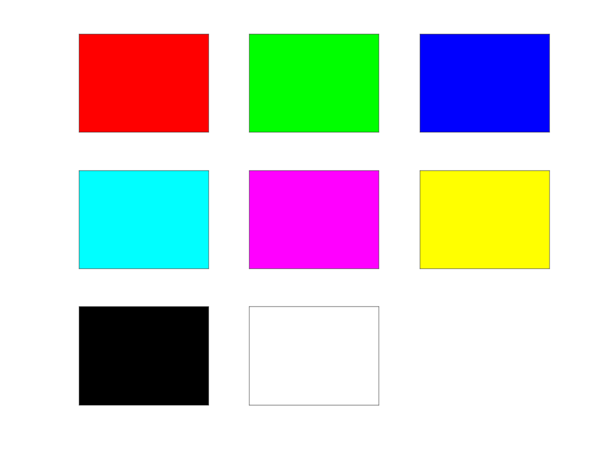

## `COLORLAB` a curated collection of color-related MATLAB libraries

For a long time Matlab has excelled for its plotting features, at a point where [matplotlib](https://matplotlib.org), arguably the most popular open-source plotting library nowadays, has started as an explicit clone of such functionality and still today keeps a strong influence. In recent years, though, one important aspect has greatly evolved in the plotting business: color management. So we had [Dave Green's 2011 paper](https://astron-soc.in/bulletin/11June/289392011.pdf) introducing a new, revolutionary, colormap with the aim of representing astronomical data with monotonically increasing brightness (and so black-and-white print friendliness); then in 2015 even better advances by the SciPy team, enriching matplotib with beautiful _perceptually uniform_ colormaps ([viridis, magma, plasma](https://www.youtube.com/watch?v=xAoljeRJ3lU) and the [domain-specific ones for oceanography: cmocean](https://youtu.be/XjHzLUnHeM0)). Meanwhile the results of a totally crazy and marvelous at the same time [2010 color survey](https://blog.xkcd.com/2010/05/03/color-survey-results/) made by the great xkcd webcomic, have gained more and more popularity, in fact challenging the old and trusted [X11 colorset](https://en.wikipedia.org/wiki/X11_color_names). Nowadays it's embedded again in [matplotlib](https://matplotlib.org/stable/tutorials/colors/colors.html) and available in [LaTeX](https://www.ctan.org/pkg/xkcdcolors), in [R](https://cran.r-project.org/web/packages/xkcdcolors/), and [Julia](https://github.com/JuliaGraphics/NamedColors.jl).

So here we provide a fair amount of such new color functionality, building up on the firm shoulders of two giants:

- [Chad. A. Greene](https://github.com/chadagreene), one of the coauthors of the [cmocean launch paper](https://dx.doi.org/10.5670/oceanog.2016.66) and prolific matlab-file-exchange contributor.

- [Stephen Cobeldick](https://github.com/DrosteEffect), refined matlab programmer and color-theory expert.

The codebase mainly embeds several functions and packages by these two authors, retrieved either from the [file-exchange](https://www.mathworks.com/matlabcentral/fileexchange/) or github and then appropriately tweaked/extended, while providing some common wrappers and tools.    
All for a unified user experience.


  - [Installation](#installation)
  - [Usage](#usage)
    - [Select all available colormaps via `set_palette`](#select-all-available-colormaps-via-set_palette)
    - [Preset parameters for colormap generators via `preset_palette`](#preset-parameters-for-colormap-generators-via-preset_palette)
    - [Common colornames for RGB triplets via the mighty `str2rgb`](#common-colornames-for-rgb-triplets-via-the-mighty-str2rgb)
    - [HEX to RGB and viceversa through `hex2rgb` and `rgb2hex`](#hex-to-rgb-and-viceversa-through-hex2rgb-and-rgb2hex)
    - [Build fully custom diverging colormaps through `diverging_cmap`](#build-fully-custom-diverging-colormaps-through-diverging_cmap)
    - [Additional interactive functionality through `view_color`](#additional-interactive-functionality-through-view_color)
    - [BONUS: we embeed also the legendary `cprintf`, for colorful terminal output (with caveats)](#bonus-we-embeed-also-the-legendary-cprintf-for-colorful-terminal-output-with-caveats)
  - [TODO list](#todo-list)

### Installation

To start using the packages just:

1. clone the repository somewhere in your machine
   ```ssh
   git clone https://github.com/bellomia/colorlab.git
   ```
2. start a matlab session therein and type
   ```matlab
   >> colorlab.enter
   >> savepath % to make changes resilient to session restart
   ```
3. call any function, import any subpackage as explained [below](#usage) :)

4. If you wish to unoad the library from the matlab path, just type in the commmand window (from whatever directory)
   ```matlab
   >> colorlab.leave
   >> savepath
   ```

### Usage

The higher level API consists of the functions included in the colortools folder. Ideally the user would mostly use just these, although lower level machinery is made available by means of specialized namespaces. These are thoroughly documented in specific READMEs, to which we'll refer whenever appropriate:

- [`BREWER`](brewer/README.md) colormap package.
- [`CMOCEAN`](cmocean/README.md) colormap package.
- [`CRAMERI`](crameri/README.md) colormap package.
- [`CUBEHELIX`](cubehelix/README.md) colormap package.
- [`MATPLOTLIB`](matplotlib/README.md) colormap package.
- [`RGB`](+rgb/README.md) colorname package, to allow selecting colors by their conventional names.

So let's start now describing the colortools!

#### Select all available colormaps via `set_palette`

The `set_palette` command wraps all the provided colormap packages, exposing to the user a very simple and intuitive interface. Just feed a colormap name and it will set it up for the current figure or, if unrecognized, suggest some "nearest" matches for you, e.g.

```matlab
>> set_palette grey
   Palette "grey" not found!
   Consider one of these options:
      {'Greys'}
      {'RdGy' }
      {'gray' }
>> set_palette gray
   gray got through palette.cmocean
```

As you can see, for any valid colormap name `set_palette` would inform you about which specific generator has been internally called. A full list of all available colormaps shall be obtained by typing `set_palette list`. For more info type `help set_palette`.

Experimentally, `set_palette` supports also giving non-default parameters to the underlying colormap generators. Just call it as:

```matlab
>> set_palette('name',Number_of_Levels,varargin)
```

To set the `<name>` colormap with the desired `Number_of_Levels` and pass further generator-specific options through the `varargins`. Info about the required structure of such additional parameters is  available within generator-specific docstrings: `help palette.<generator-name>`. 

Of course you can call directly the generators, which are all collected under the `palette` namespace. They have very different APIs so inspection of the generator-specific READMEs linked above is strongly advised. 

Some generators provide single, fine-tuned, colormaps with the only option to select the number of levels. This is the case e.g. of `palette.viridis` which provides the current default colormap in matplotlib, [born as an open-source alternative to matlab's `parula`](https://www.youtube.com/watch?v=xAoljeRJ3lU). You can compare the two by:

```matlab
ax(1) = subplot(1,2,1); 
cmap = parula(); % Built-in in Matlab
rgbplot(cmap); title('parula')
xlim([0,256]); xticks([]);
colorbar('southoutside');
colormap(ax(1),cmap); 

ax(2) = subplot(1,2,2); 
cmap = palette.viridis;
rgbplot(cmap); title('viridis')
xlim([0,256]); xticks([]);
colorbar('southoutside');
colormap(ax(2),cmap); 
```


Other generators provide complex algorithms that allow crafting your own colormap, with a high degree of customization. The richer example is currently given by `palette.cubehelix` which can easily mimic the alternatives, like in:

```matlab
ax(1) = subplot(1,2,1); 
cmap = palette.magma;
rgbplot(cmap); title('Original Magma')
xlim([0,256]); xticks([]);
colorbar('southoutside');
colormap(ax(1),cmap); 

ax(2) = subplot(1,2,2); % MAGMA-like CubeHelix params!
cmap = palette.cubehelix([],0,0.6,1.6,0.9,[0,1],[0,0.8]);
rgbplot(cmap); title('CubeHelix Magma')
xlim([0,256]); xticks([]);
colorbar('southoutside');
colormap(ax(2),cmap);
```


Note that `set_palette('cubehelix',[],0,0.6,1.6,0.9,[0,1],[0,0.8])` is a totally valid call to the generic wrapper, allowing the selection of our 'fake-magma' colormap through the cubehelix generator, without explicitly calling the specific `palette.cubehelix` function:

```matlab
>> imagesc(peaks(500))
>> set_palette('cubehelix',[],0,0.6,1.6,0.9,[0,1],[0,0.8])
   cubehelix got through palette.cubehelix
```


Finally, despite giving access also to qualitative/categorical colorschemes, `set_palette` is currently not so useful in this area, since matlab treats colormaps and 'color-orders' in a totally different way. We might add a proper wrapper for this in future. For now you can set the color orders with the low level palette functions, as in:

```matlab
set(0,'DefaultAxesColorOrder',palette.<your-choice>)
N = 6;
X = linspace(0,pi*3,1000);
Y = bsxfun(@(x,n)n*sin(x+2*n*pi/N), X.', 1:N);
for n = 1:N
   plot(X(:),Y(:,n), 'linewidth',4);
   hold all
end
xlim([0,3*pi]);
```
Some examples (non exhaustive):

`palette.tab10` | `palette.tab20` | 
------|-------|
 | 

`palette.brewer('Accent')` | `palette.brewer('Pastel2')`
------|-------|
 |  | 

`palette.crameri('actonS')` | `palette.crameri('turkuS')`
------|-------|
 | 

More examples can be found in the [`lego.m`](.test/lego.m) test script, giving a fun rendition of the matlab logo:


#### Preset parameters for colormap generators via `preset_palette` 

The generic "lambda-wrapper" `preset_palette` makes it easy to store complex parameters for the highly customizable generators, so to allow applying the desired colormap with the short `colormap(preset_palette)` afterwards. The generic syntax is 
```matlab
preset_palette(@lambda_function,varargin)
```
as in
```matlab
>> preset_palette(@cubehelix.map,0.25,-0.67,1.5,1)
>> colormap(preset_palette)
```

It can also come handy to circumvent come limitations in composability with toolboxes, since it exposes an interface that is exactly identical to official built-in colormap functions. For instance, one can easily use the infamous `contourcmap` function, from the Mapping Toolbox, with any of the provided colormaps, even with custom parameters:

```matlab
% preselect the colorscheme.
preset_palette(@palette.<choice>,<parameters>); 
% build the worldmap 
load topo
load coastlines
figure
worldmap(topo, topolegend);
contourfm(topo, topolegend);
plotm(coastlat, coastlon, 'k'); 
% apply the preselected colormap
contourcmap('preset_palette', 'Colorbar','on', 'Location','horizontal',...
'TitleString','Contour Intervals in Meters');
```

> Note that something like `contourcmap('palette.<choice>')` would not work, due to how `countourcmap` evaluates the given colormap names!

Here we show some wonderful choices for our worldmap!

`<choice>`  | `<parameters>` | `contourcmap`
------|-----|-----|
`viridis` | `N/A` |  |
`cubehelix` | `3,-0.5,1.5,1` |  |
`brewer` | `'-PuOr'`|  |
`cmocean` | `'topo'` |  |
`crameri` | `'oleron'` | 


#### Common colornames for RGB triplets via the mighty `str2rgb`

[🚧🚧🚧 Work ⚠️ in 🪜 Progress 🚧🚧🚧🚧🚧🚧 ]

```matlab
X11 = rgb.X11('list')
XKCD = rgb.xkcd('list')
overlap = intersect(X11,XKCD)
view_color(rgb.X11(overlap),'hbars')
view_color(rgb.xkcd(overlap),'hbars')
```
 `overlap` | `rgb.X11(overlap)` | `rgb.xkcd(overlap)` |
--|--|--|
| | |

#### RGB to HEX space and viceversa through `rgb2hex` and `hex2rgb`

[🚧🚧🚧 Work ⚠️ in 🪜 Progress 🚧🚧🚧🚧🚧🚧 ]

#### Build fully custom diverging colormaps through `diverging_cmap`

[🚧🚧🚧 Work ⚠️ in 🪜 Progress 🚧🚧🚧🚧🚧🚧 ]

#### Additional interactive functionality through `view_color`

To help interactive exploration we furthermore provide a very simple --yet effective-- tool to visualize small collections of colors, so to allow fast visual comparisons and easier overall evaluation of different colornames. It supports single or multiple colors (as cells, not multiple arguments allowed, currently) and an optional string to specify the visual format of the shown palette: `'squares'` for a matrix, `'hbars'` and `'vbars'` for respectively horizontal and vertical barplots. It supports colornames from _both_ the X11 and xkcd datasets, prioritizing the latter when there is collision: learn more about our naming criteria in the docstrings of [`str2rgb`](../colortools/str2rgb.m), our higher level wrapper for colorname-to-rgb-triplet conversions, which includes also other smaller sets and provide a hex-to-rgb converter.

Some examples:

```matlab
view_color({'r','g','b','c','m','y','k','w'},'squares')
view_color({'strawberry','apple','blueberry',"banana"})
view_color({'pyplot1',"pyplot2",'pyplot3'},'vbars')
view_color({'matlab1','matlab2','matlab3','matlab4'},'hbars')
view_color(palette.tab20(16),'hbars')
view_color(palette.cubehelix(36))
```
would produce the following (left-right and top-down ordering):

 | 
--|--
 | 
 | 

#### BONUS: we embeed also the legendary `cprintf`, for colorful terminal output (with caveats)

[...]

### TODO list

- [ ] Implement the `'-name'` reverse option within `set_palette`, it is present in most colormap generators (all except the matplotlib ones) but we cannot use it in the wrapper. It would be handy to have...

- [x] Convert `set_palette` into a `get_palette` wrapper, to actually retrieve the raw RGB triplets. This would be internally called by a new `set_palette`. It might also help with the previous point (the `'-name'` reverse).

- [ ] Write a `set_colororder` wrapper, to allow easier set of color order in figures. Still don't have a clear strategy.