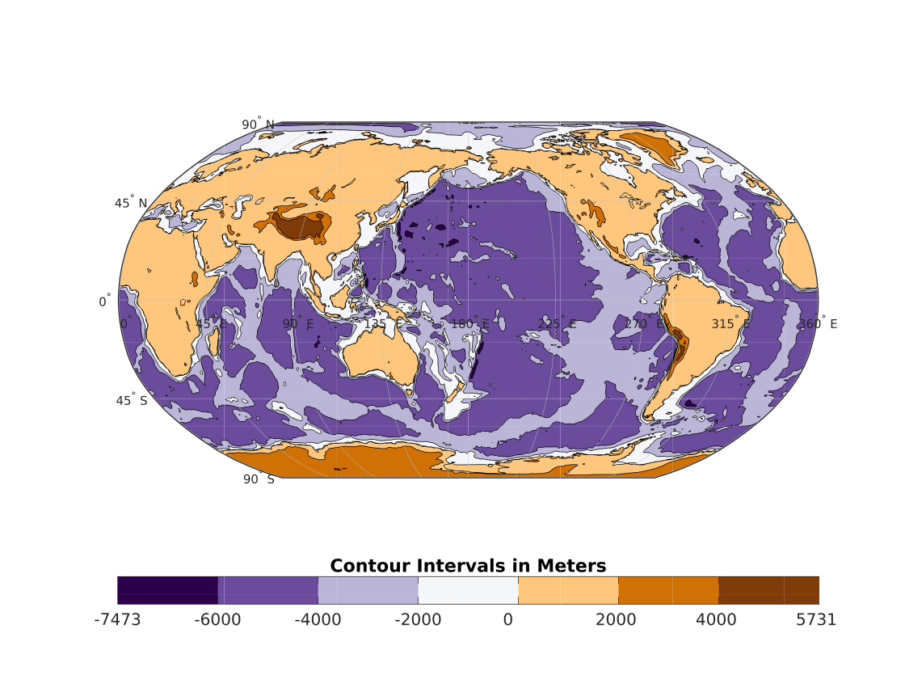
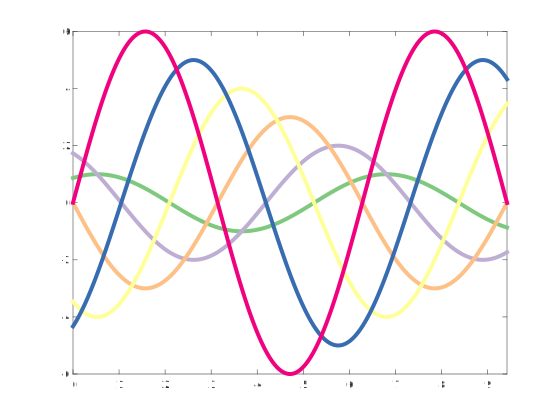

BREWER Colormap Package
=======================

BREWER provides _all_ ColorBrewer[^1] discrete schemes, with simple selection by colormap length and scheme name. Alternatively the scheme name can be preselected, after which only the colormap length is required to define an output colormap. Remarkably, **downsampling or interpolation or repetition of the nodes occurs automatically**, making the schemes easily adapted to continuos-colormap use cases. Interpolation happens in the CIELAB colorspace.

⚠ While the original [BrewerMap function](https://github.com/DrosteEffect/BrewerMap) is natively compatible with all MATLAB functions that require a colormap function, even those in Toolboxes, the packaging has broken some corner cases, due to MATLAB's idiosyncrasies with namespace qualification. For instance this syntax would **not** do the job for the infaust Mapping Toolbox function CONTOURCMAP:
```matlab
    contourcmap('palette.brewer') % DOES NOT WORK
``` 
Nevertheless the issue can be easily overcome by presetting the colormap with our custom [lambda-wrapper](#how-to-make-a-scheme-permanent-presetpalette-function):
```matlab
    preset_palette(@palette.brewer, '-PuOr'); % preselection
    contourcmap('preset_palette') % VALID COLORMAP INPUT
``` 

## Overview: colorschemes and main ##


The BREWER package:
* Consists of just three convenient .m files (no .mat files or other clutter).
* Has no third-party file dependencies.
* Has no special toolbox dependencies.
* Interpolates in the CIELAB colorspace.
* Requires just the standard ColorBrewer colorscheme name to select the colorscheme.
* Accepts the colorscheme name as a string scalar or a character vector.
* Supports all ColorBrewer colorschemes.
* Outputs a MATLAB standard N-by-3 numeric RGB array.
* Uses a default length the same as MATLAB's colormap functions.
* Is compatible with all MATLAB toolboxes that use colormaps. (see examples for how to handle edgecases)
* Includes the option to reverse the color sequence: just put a `-` in front of the desired colorscheme name (see examples).
* Does not break ColorBrewer's Apache license conditions (unlike many on MATLAB File Exchange).

The above table, showing all the discrete schemes defined in the package, can be retrieved at run time by invoking the `paletteshow.brewer` command.

### Examples: command line usage through `palette.brewer()` function ###

```matlab
    % Brewer colors for a sample PHOTO:
    S = load('mandrill');
    imshow(S.X,colormap(palette.brewer([],"-YlGnBu"))) % reversed yellow-green-blue scheme
```

```matlab
    % Brewer colors for a sample SURF:
    [X,Y,Z] = peaks(50);
    surfc(X,Y,Z)
    colormap(palette.brewer([],'-RdBu')) % reversed red-blue divergent scheme
```

```matlab
    % A trick to deal with nasty CONTOURCMAP function (Mapping Toolbox):
    preset_palette(@palette.brewer, '-PuOr'); % preselect the colorscheme.
    load topo
    load coastlines
    figure
    worldmap(topo, topolegend);
    contourfm(topo, topolegend);
    plotm(coastlat, coastlon, 'k'); 
    contourcmap('preset_palette', 'Colorbar','on', 'Location','horizontal',...
    'TitleString','Contour Intervals in Meters'); % Et Voilà...
    % -> we have applied our beautiful colormap through the preset function!
```

```matlab
    % Plot and compare RGB values:
    ax(1) = subplot(1,2,1); 
    cmap = palette.brewer(NaN, 'PiYG');
    rgbplot(cmap); title('Standard PiYG')
    xlim([1,11]); xticks([]);
    colorbar('southoutside');
    colormap(ax(1),cmap); 

    ax(2) = subplot(1,2,2);
    cmap = palette.brewer(NaN,'-PiYG');
    rgbplot(cmap); title('Reversed PiYG')
    xlim([1,11]); xticks([]);
    colorbar('southoutside');
    colormap(ax(2),cmap);
```

```matlab    
    % View information about a colorscheme:

    >> [~,num,typ] = palette.brewer(NaN,'Paired')
    
    num =

        12


    typ =

        'Qualitative'
```
```matlab
    % Multiline plot using matrices:
    N = 6;
    axes('ColorOrder',palette.brewer(N,'Pastel2'),'NextPlot','replacechildren')
    X = linspace(0,3*pi,1000);
    Y = bsxfun(@(x,n)n*sin(x+2*n*pi/N), X.', 1:N);
    plot(X,Y, 'linewidth',4); box on; xlim([0,3*pi]);
```

```matlab
    % Multiline plot in a loop:
    set(0,'DefaultAxesColorOrder',palette.brewer(NaN,'Accent'))
    N = 6;
    X = linspace(0,10,1000);
    Y = bsxfun(@(x,n)n*sin(x+2*n*pi/N), X.', 1:N);
    for n = 1:N
        plot(X(:),Y(:,n), 'linewidth',4);
        hold all
    end
    xlim([0,3*pi]);
```


### Bonus: interactive usage through `paletteshow.brewer()` and `paletteditor.brewer()` ###

PALETTESHOW creates a static figure which shows the nodes (defining colors) of all ColorBrewer colorschemes, so that you could check any time the colorcodes and pick what most inspires you.

PALETTEDITOR creates an interactive figure that allows dynamic selection of the colorscheme, while displaying the colorbars for both the colormap and its grayscale equivalent.

> R2014b or later: the `PALETTEDITOR` can also update other axes' or figures' colormaps in real time, for example:

```matlab
    S = load('spine');
    image(S.X)
    paletteditor.brewer(gca)
```

### How to make a scheme permanent: `preset_palette()` function ###

PRESET_PALETTE is a wrapper for any colormap function, storing the function and any parameter values for future calls.

```matlab
    preset_palette(@palette.brewer, "blues")
    colormap(preset_palette)
```

### COPYRIGHT & LICENSING ###

 © 2014-2022 Stephen Cobeldick, original [BREWERMAP Function](https://github.com/DrosteEffect/BrewerMap)    
 © 2022 Gabriele Bellomia, PALETTE Package adaptation and embedding

 Licensed under the Apache License, Version 2.0 (the "License");
 you may not use this file except in compliance with the License.
 You may obtain a copy of the License at:

 http://www.apache.org/licenses/LICENSE-2.0

 Unless required by applicable law or agreed to in writing, software
 distributed under the License is distributed on an "AS IS" BASIS,
 WITHOUT WARRANTIES OR CONDITIONS OF ANY KIND, either express or implied.
 See the License for the specific language governing permissions and limitations under the License.


[^1]: This product includes color specifications and designs developed by Cynthia Brewer (http://colorbrewer.org/). See the ColorBrewer website for further information about each colorscheme, colorblind suitability, licensing, and citations.