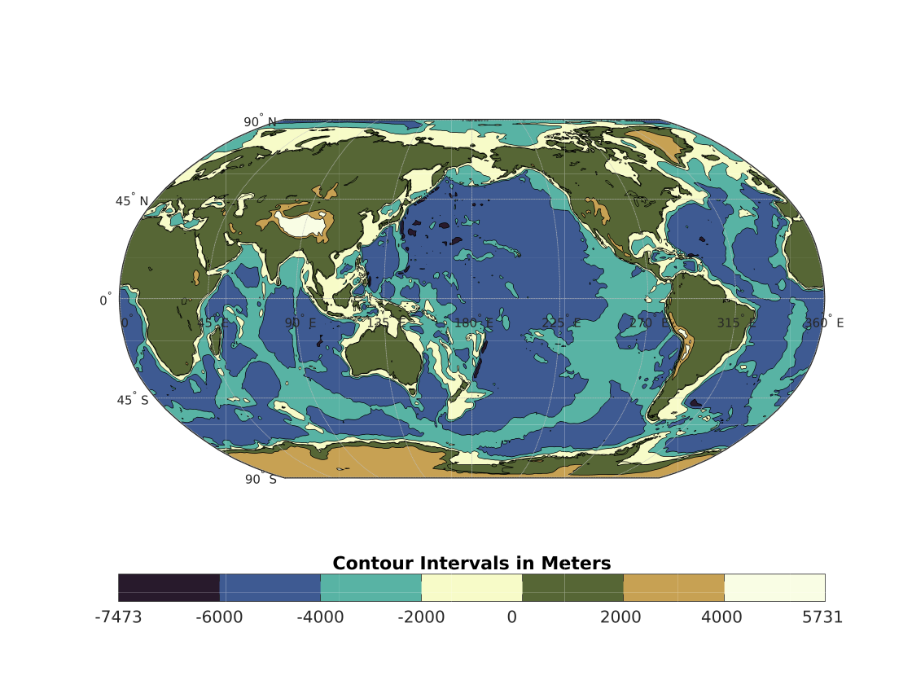
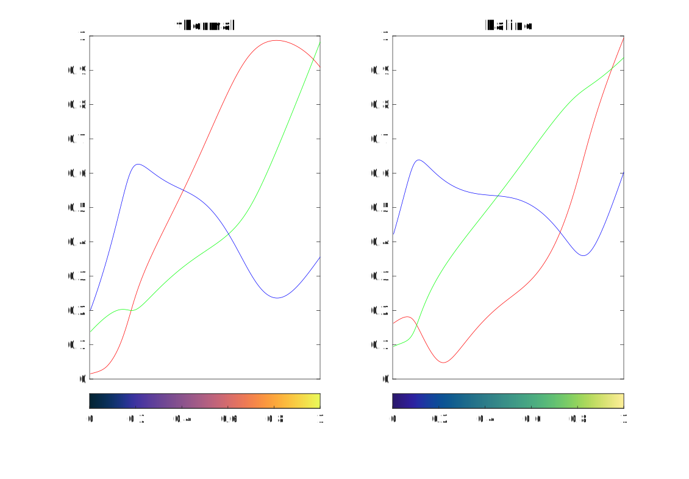

CMOCEAN Colormap Package
========================

CMOCEAN provides a MATLAB port of the beautiful homonym package in matplotlib. Check [their page](https://matplotlib.org/cmocean/) for a full description of the colormaps and the original intended usage. Please consider citing the launch paper if you adopt any of the provided colormaps in your publication: 

> Thyng, K.M., C.A. Greene, R.D. Hetland, H.M. Zimmerle, and S.F. DiMarco. 2016. True colors of oceanography: Guidelines for effective and accurate colormap selection. Oceanography 29(3):9–13. [https://dx.doi.org/10.5670/oceanog.2016.66](https://dx.doi.org/10.5670/oceanog.2016.66)

## Overview: colorschemes and main functionalities ##

 we have applied our beautiful colormap through the preset function!
```   
     
🚧🚧🚧🚧🚧🚧🚧🚧🚧🚧🚧🚧🚧
---------------------------------- 
```matlab
    % Plot and compare RGB values:
    ax(1) = subplot(1,2,1); 
    cmap1 = palette.cmocean('thermal');
    rgbplot(cmap1); title('thermal')
    xlim([0,256]); xticks([]);
    colorbar('southoutside');
    colormap(ax(1),cmap1); 

    ax(2) = subplot(1,2,2);
    cmap2 = palette.cmocean('haline');
    rgbplot(cmap2); title('haline')
    xlim([0,256]); xticks([]);
    colorbar('southoutside');
    colormap(ax(2),cmap2);
```


### How to make a scheme permanent: `preset_palette()` function ###

PRESET_PALETTE is a wrapper for any colormap function, storing the function and any parameter values for future calls.

```matlab
    preset_palette(@palette.cmocean, 'algae')
    colormap(preset_palette)
```

### COPYRIGHT & LICENSING ###

© 2021 Chad Greene, original [CMOCEAN function](https://www.mathworks.com/matlabcentral/fileexchange/57773-cmocean-perceptually-uniform-colormaps)    
© 2022 Gabriele Bellomia, PALETTE package adaptation and embedding    
All rights reserved, MIT license.

Permission is hereby granted, free of charge, to any person obtaining a copy
of this software and associated documentation files (the "Software"), to deal
in the Software without restriction, including without limitation the rights
to use, copy, modify, merge, publish, distribute, sublicense, and/or sell
copies of the Software, and to permit persons to whom the Software is
furnished to do so, subject to the following conditions:

The above copyright notice and this permission notice shall be included in all
copies or substantial portions of the Software.

THE SOFTWARE IS PROVIDED "AS IS", WITHOUT WARRANTY OF ANY KIND, EXPRESS OR
IMPLIED, INCLUDING BUT NOT LIMITED TO THE WARRANTIES OF MERCHANTABILITY,
FITNESS FOR A PARTICULAR PURPOSE AND NONINFRINGEMENT. IN NO EVENT SHALL THE
AUTHORS OR COPYRIGHT HOLDERS BE LIABLE FOR ANY CLAIM, DAMAGES OR OTHER
LIABILITY, WHETHER IN AN ACTION OF CONTRACT, TORT OR OTHERWISE, ARISING FROM,
OUT OF OR IN CONNECTION WITH THE SOFTWARE OR THE USE OR OTHER DEALINGS IN THE
SOFTWARE.
