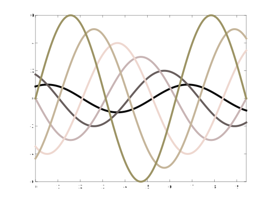

CRAMERI Colormap Package
========================

CRAMERI provides an ergonomic packaging of the _Scientific Colourmaps_ provided by Fabio Crameri under the MIT license at https://www.fabiocrameri.ch/colourmaps/. If using any of the provided colorschemes in a publication you should cite the following references:

- Crameri, F. (2018). Scientific colour maps. Zenodo.    
  https://doi.org/10.5281/zenodo.1243862

- Crameri, F., G.E. Shephard, and P.J. Heron (2020), The misuse of colour in science communication, Nature Communications, 11, 5444. https://doi.org/10.1038/s41467-020-19160-7

## Overview: colorschemes and main functionalities ##


The above table, showing all the continuous colormaps defined in the package, can be retrieved at run time by invoking the `paletteshow.crameri` command. Please note that all the sequential colormaps have also a corresponding categorical/qualitative colorset, that can be requested by appending an uppercase `S` at the end of the name, e.g. `palette.crameri('turku')` would give the Turku colormap and `palette.crameri('turkuS')` the corresponding discrete colorset. All colorschemes can be inverted by prepending a `-` character (e.g. `palette.crameri('-turku')`). Calling `palette.crameri` without outputs would automatically set the colorscheme, without the need to explicitly calling the built-in `colormap` function. More info can be found typing `help palette.crameri` or by inspection of the following examples.

### Examples: command line usage through `palette.crameri()` function ###

```matlab
    % Oslo colormap for a sample PHOTO:
    S = load('mandrill');
    imshow(S.X,palette.crameri('oslo'))
```

```matlab
    % A nice alternative to the classic red-blue divergent map:
    [X,Y,Z] = peaks(50);
    surfc(X,Y,Z+4)
    palette.crameri('bam','pivot',4) % recenter the color-axis
```
       
```matlab
    % A trick to deal with nasty CONTOURCMAP function (Mapping Toolbox):
    preset_palette(@palette.crameri, 'oleron'); % preselect the colorscheme.
    load topo
    load coastlines
    figure
    worldmap(topo, topolegend);
    contourfm(topo, topolegend);
    plotm(coastlat, coastlon, 'k'); 
    contourcmap('preset_palette', 'Colorbar','on', 'Location','horizontal',...
    'TitleString','Contour Intervals in Meters'); % Et Voilà...
    % -> we have applied our beautiful colormap through the preset function!
```   
     
```matlab
    % Plot and compare RGB values:
    ax(1) = subplot(1,3,1); 
    cmap1 = palette.crameri('batlowK');
    rgbplot(cmap1); title('batlowK')
    xlim([0,256]); xticks([]);
    colorbar('southoutside');
    colormap(ax(1),cmap1); 

    ax(2) = subplot(1,3,2);
    cmap2 = palette.crameri('batlow');
    rgbplot(cmap2); title('batlow')
    xlim([0,256]); xticks([]);
    colorbar('southoutside');
    colormap(ax(2),cmap2);

    ax(3) = subplot(1,3,3);
    cmap3 = palette.crameri('batlowW');
    rgbplot(cmap3); title('batlowW')
    xlim([0,256]); xticks([]);
    colorbar('southoutside');
    colormap(ax(3),cmap3);
```

```matlab
    % Multiline plot using matrices:
    N = 6;
    axes('ColorOrder',palette.crameri('turkuS'),'NextPlot','replacechildren')
    % > notice that N is not passed, replaced by the *S categorical option.
    X = linspace(0,3*pi,1000);
    Y = bsxfun(@(x,n)n*sin(x+2*n*pi/N), X.', 1:N);
    plot(X,Y, 'linewidth',4); box on; xlim([0,3*pi]);
```

```matlab
    % Multiline plot in a loop:
    set(0,'DefaultAxesColorOrder',palette.crameri('actonS'))
    % > notice the *S option, giving a categorical colormap.
    N = 6;
    X = linspace(0,10,1000);
    Y = bsxfun(@(x,n)n*sin(x+2*n*pi/N), X.', 1:N);
    for n = 1:N
        plot(X(:),Y(:,n), 'linewidth',4);
        hold all
    end
    xlim([0,3*pi]);
```


### Upgrading: retrieve any release on ZENODO with `crameri_update()` ###

If you wish to upgrade the colormaps (currently we bundle version 7.0.1) we provide a semi-automatic[^1] procedure: you need to visit the official [ZENODO repository](http://doi.org/10.5281/zenodo.1243862) and annotate the record number of the version you want to download. So you can type

```matlab
    crameri_update(release_major,record_number)
```
and wait for MATLAB to download and appropriately place the official color data inside your package installation. Immediately after finish the updated colormaps are ready to call with the palette.crameri command. Invoking `crameri_update`, without inputs, will print to stdout the docstring, so to alleviate the annoyance of retrieving the doi link.

[^1]: Making the workflow completely automatic, i.e. upgrading to latest release by default or to any version if requested (but without quering for the explicit record number), is an intended future enhancement. Though it might not come soon, being ZENODO somehow uncooperative on the matter.

### How to make a scheme permanent: `preset_palette()` function ###

PRESET_PALETTE is a wrapper for any colormap function, storing the function and any parameter values for future calls.

```matlab
    preset_palette(@palette.crameri, '-berlin')
    colormap(preset_palette)
```

### COPYRIGHT & LICENSING ###

© 2018 Chad A. Greene, original [CRAMERI function](https://it.mathworks.com/matlabcentral/fileexchange/68546-crameri-perceptually-uniform-scientific-colormaps)     
© 2022 Gabriele Bellomia, PALETTE package adaptation      
All rights reserved.

Redistribution and use in source and binary forms, with or without
modification, are permitted provided that the following conditions are met:

* Redistributions of source code must retain the above copyright notice, this
  list of conditions and the following disclaimer.

* Redistributions in binary form must reproduce the above copyright notice,
  this list of conditions and the following disclaimer in the documentation
  and/or other materials provided with the distribution

* Neither the name of The University of Texas at Austin nor the names of its
  contributors may be used to endorse or promote products derived from this
  software without specific prior written permission.

THIS SOFTWARE IS PROVIDED BY THE COPYRIGHT HOLDERS AND CONTRIBUTORS "AS IS"
AND ANY EXPRESS OR IMPLIED WARRANTIES, INCLUDING, BUT NOT LIMITED TO, THE
IMPLIED WARRANTIES OF MERCHANTABILITY AND FITNESS FOR A PARTICULAR PURPOSE ARE
DISCLAIMED. IN NO EVENT SHALL THE COPYRIGHT OWNER OR CONTRIBUTORS BE LIABLE
FOR ANY DIRECT, INDIRECT, INCIDENTAL, SPECIAL, EXEMPLARY, OR CONSEQUENTIAL
DAMAGES (INCLUDING, BUT NOT LIMITED TO, PROCUREMENT OF SUBSTITUTE GOODS OR
SERVICES; LOSS OF USE, DATA, OR PROFITS; OR BUSINESS INTERRUPTION) HOWEVER
CAUSED AND ON ANY THEORY OF LIABILITY, WHETHER IN CONTRACT, STRICT LIABILITY,
OR TORT (INCLUDING NEGLIGENCE OR OTHERWISE) ARISING IN ANY WAY OUT OF THE USE
OF THIS SOFTWARE, EVEN IF ADVISED OF THE POSSIBILITY OF SUCH DAMAGE.
