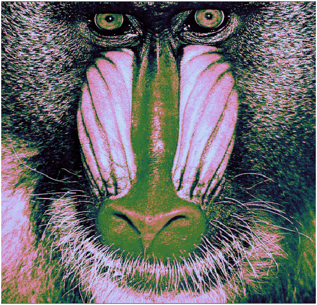
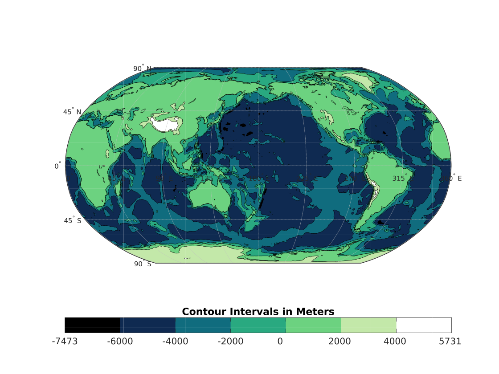
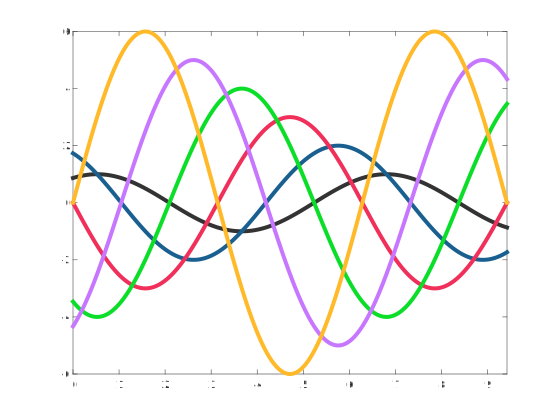
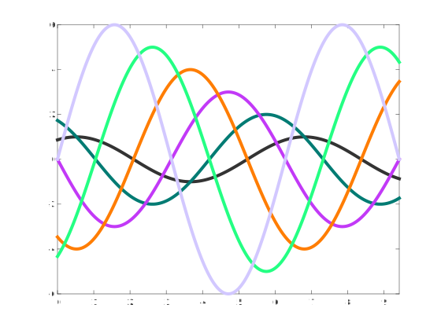

CUBEHELIX Colormap Package
==========================

CUBEHELIX generates a huge family of perceptually accurate[^1] continuous colormaps: they all range from black to white[^2] with a well-behaved monotonic increase in intensity, such that the data representation is well preserved if printed / converted to grayscale. The helical deviation from the pure grayscale diagonal, in RGB space, takes into account that red, green and blue colors are not perceived equally in terms of intensity.

[^1]: But not _exact_, for that you might want to check the [MATPLOTLIB Colormap Package](../matplotlib/).

[^2]: This statement applies to the original implementation. The present package actually allows to tweak the intensity range and color domain, so to greatly enhance flexibility and help avoid color clipping. For more info about these two extra parameters invoke `help palette.cubehelix`.

The CUBEHELIX algorithm[^3] is originally defined [here](http://astron-soc.in/bulletin/11June/289392011.pdf). For more information and examples take a look at [Dave Green's blogpost](http://www.mrao.cam.ac.uk/~dag/CUBEHELIX/). Despite the original author declaring it as "a" colourscheme, the algorithm is actually very flexible, allowing the definition of a huge variety of sequential and even, to some extent, qualitative colorschemes. Of course a heavily tweaked colormap could easily lose the originally intended good properties so any deviation from default parameters warrants for some grain of salt.

[^3]: ⚠ Please note that the original specification (the links above) mispelled the saturation option as "hue". In the CUBEHELIX functions the saturation option is appropriately renamed as "satn".

### Examples: command line usage through `palette.cubehelix()` ###

```matlab
    %% Classic CubeHelix mapping of a PHOTO:
    S = load('mandrill');
    imshow(S.X,colormap(palette.cubehelix)) % default parameters: classic look!
```

```matlab
    % Generating a brand new cmap for a SURF:
    [X,Y,Z] = peaks(30);
    surfc(X,Y,Z)
    colormap(palette.cubehelix([],3,-0.5,1.5,1)) % Giving a relaxed forest-green vibe
```

```matlab
    %% A trick to deal with nasty CONTOURCMAP function (Mapping Toolbox):
    preset_palette(@palette.cubehelix, 3,-0.5,1.5,1); % preselect the map.
    load topo
    load coastlines
    figure
    worldmap(topo, topolegend);
    contourfm(topo, topolegend);
    plotm(coastlat, coastlon, 'k'); 
    contourcmap('preset_palette', 'Colorbar','on', 'Location','horizontal',...
    'TitleString','Contour Intervals in Meters'); % Et Voilà...
    % -> a beautifully appropriate colormap for the worldmap: sea, land, snow!
```

```matlab
    %% Plot and compare RGB values:
    ax(1) = subplot(1,2,1); 
    cmap = palette.cubehelix(); % Default CubeHelix
    rgbplot(cmap); title('Default CubeHelix')
    xlim([0,256]); xticks([]);
    colorbar('southoutside');
    colormap(ax(1),cmap); 

    ax(2) = subplot(1,2,2); % MAGMA-like CubeHelix params!
    cmap = palette.cubehelix([],0,0.6,1.6,0.9,[0,1],[0,0.8]);
    rgbplot(cmap); title('Magma-like CubeHelix')
    xlim([0,256]); xticks([]);
    colorbar('southoutside');
    colormap(ax(2),cmap); % ----> Notice red is clipped!
```

```matlab
    %% Multiline plot using matrices: 
    N = 6; % [If you tweak it enough it would give even nice discrete schemes]
    cmap = palette.cubehelix(N+2,1.5,3,3,1,[0.2,1],[0,0.9]); % Define
    axes('ColorOrder',cmap,'NextPlot','replacechildren');    % Set...
    X = linspace(0,pi*3,1000);
    Y = bsxfun(@(x,n)n*sin(x+2*n*pi/N), X.', 1:N);
    plot(X,Y, 'linewidth',4); box on; xlim([0,3*pi]);
```

```matlab
    % Multiline plot in a loop: [another discrete tweak!]
    cmap = palette.cubehelix(N+1,1.5,2,3,1,[0.2,1],[0,0.9]); % Define
    set(0,'DefaultAxesColorOrder',cmap)                      % Set...
    N = 6;
    X = linspace(0,pi*3,1000);
    Y = bsxfun(@(x,n)n*sin(x+2*n*pi/N), X.', 1:N);
    for n = 1:N
        plot(X(:),Y(:,n), 'linewidth',4);
        hold all
    end
    xlim([0,3*pi]);
```


### Bonus: interactive usage through `paletteditor.cubehelix()` ###

CUBEHELIX GUI creates an interactive figure that allows dynamic selection of the colorscheme, while displaying the colorbars for both the colormap and the grayscale equivalent.

> R2014b or later: the `PALETTEDITOR` can also update other axes' or figures' colormaps in real time, for example:

```matlab
    S = load('spine');
    image(S.X)
    paletteditor.cubehelix(gca)
```

### How to make parameters permanent: `preset_palette()` function ###

PRESET_PALETTE is a wrapper for any colormap function, storing the function and any parameter values for future calls.

```matlab
    preset_palette(@palette.cubehelix, 0.5,-1.5,1,1)
    colormap(preset_palette) %         ^ Classic Dave Green's CubeHelix
```

### COPYRIGHT & LICENSING ###

 © 2013-2022 Stephen Cobeldick, original [CUBEHELIX Function](https://github.com/DrosteEffect/CubeHelix)    
 © 2022 Gabriele Bellomia, PALETTE Package adaptation and embedding

 Licensed under the Apache License, Version 2.0 (the "License");
 you may not use this file except in compliance with the License.
 You may obtain a copy of the License at:

 http://www.apache.org/licenses/LICENSE-2.0

 Unless required by applicable law or agreed to in writing, software
 distributed under the License is distributed on an "AS IS" BASIS,
 WITHOUT WARRANTIES OR CONDITIONS OF ANY KIND, either express or implied.
 See the License for the specific language governing permissions and limitations under the License.