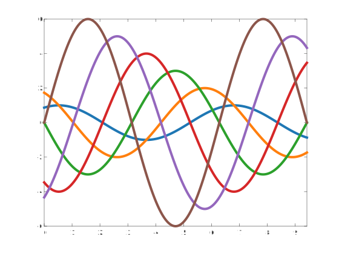

MATPLOTLIB Colormap Package
===========================

Providing perceptually _**exact**_ sequential and cyclic continuous colormaps and nonmisleading qualitative colorschemes from `matplotlib`. More info can be found in [matplotlib official docs](https://palette.org/stable/tutorials/colors/colormaps.html), or in the [original video presentation](https://www.youtube.com/watch?v=xAoljeRJ3lU) (a very enjoyable watch!).

## Overview of the imported colormaps ##


Note that the package delivers only a subset of all matplotlib's colorscheme, namely those that have been originally developed by its team. If you are looking for `Paired` or `RdBu`, etc... you might want to check the [BREWER](../brewer/) colormap package. Same goes for [CubeHelix](../cubehelix/) and [cmocean](../cmocean/).

### Examples: ###

```matlab
    % View a PHOTO with matplotlib default colormap
    S = load('mandrill');
    imshow(S.X,palette.viridis)
```

```matlab
    % Graph a surface with the twilight cyclic colormap
    [X,Y,Z] = peaks(50);
    surfc(X,Y,Z)
    colormap(palette.twilight_shifted) % shifted to have white at zero
```

```matlab
    % A trick to deal with nasty CONTOURCMAP function (Mapping Toolbox):
    preset_palette(@palette.viridis); % preselect the colorscheme.
    load topo
    load coastlines
    figure
    worldmap(topo, topolegend);
    contourfm(topo, topolegend);
    plotm(coastlat, coastlon, 'k'); 
    contourcmap('preset_palette', 'Colorbar','on', 'Location','horizontal',...
    'TitleString','Contour Intervals in Meters'); % Et Voilà...
    % -> we have applied the viridis colormap through the preset function!
```

```matlab
    % Plot and compare RGB values:
    ax(1) = subplot(1,2,1);
    cmap = palette.viridis;
    rgbplot(cmap); title('viridis'); 
    xlim([0,256]); xticks([]);
    colorbar('southoutside');
    colormap(ax(1),cmap); 

    ax(2) = subplot(1,2,2);
    cmap = palette.plasma;
    rgbplot(cmap); title('plasma');
    xlim([0,256]); xticks([]);
    colorbar('southoutside');
    colormap(ax(2),cmap); 
```

```matlab
    % Multiline plot using matrices:
    N = 6;
    axes('ColorOrder',palette.tab10,'NextPlot','replacechildren')
    X = linspace(0,pi*3,1000);
    Y = bsxfun(@(x,n)n*sin(x+2*n*pi/N), X.', 1:N);
    plot(X,Y, 'linewidth',4); box on; xlim([0,3*pi]);
```

```matlab
    % Multiline plot in a loop:
    set(0,'DefaultAxesColorOrder',palette.tab20)
    N = 6;
    X = linspace(0,pi*3,1000);
    Y = bsxfun(@(x,n)n*sin(x+2*n*pi/N), X.', 1:N);
    for n = 1:N
        plot(X(:),Y(:,n), 'linewidth',4);
        hold all
    end
    xlim([0,3*pi]);
```


### How to make a scheme permanent: `preset_palette()` function ###

PRESET_PALETTE is a wrapper for any colormap function, storing the function and any parameter values for future calls.

```matlab
    preset_palette(@palette.magma)
    colormap(preset_palette)
```

### COPYRIGHT & LICENSING ###
© 2022, Stephen Cobeldick, Gabriele Bellomia    
All rights reserved.

Redistribution and use in source and binary forms, with or without
modification, are permitted provided that the following conditions are met:

* Redistributions of source code must retain the above copyright notice, this
  list of conditions and the following disclaimer.

* Redistributions in binary form must reproduce the above copyright notice,
  this list of conditions and the following disclaimer in the documentation
  and/or other materials provided with the distribution

* Neither the name of  nor the names of its
  contributors may be used to endorse or promote products derived from this
  software without specific prior written permission.

THIS SOFTWARE IS PROVIDED BY THE COPYRIGHT HOLDERS AND CONTRIBUTORS "AS IS"
AND ANY EXPRESS OR IMPLIED WARRANTIES, INCLUDING, BUT NOT LIMITED TO, THE
IMPLIED WARRANTIES OF MERCHANTABILITY AND FITNESS FOR A PARTICULAR PURPOSE ARE
DISCLAIMED. IN NO EVENT SHALL THE COPYRIGHT OWNER OR CONTRIBUTORS BE LIABLE
FOR ANY DIRECT, INDIRECT, INCIDENTAL, SPECIAL, EXEMPLARY, OR CONSEQUENTIAL
DAMAGES (INCLUDING, BUT NOT LIMITED TO, PROCUREMENT OF SUBSTITUTE GOODS OR
SERVICES; LOSS OF USE, DATA, OR PROFITS; OR BUSINESS INTERRUPTION) HOWEVER
CAUSED AND ON ANY THEORY OF LIABILITY, WHETHER IN CONTRACT, STRICT LIABILITY,
OR TORT (INCLUDING NEGLIGENCE OR OTHERWISE) ARISING IN ANY WAY OUT OF THE USE
OF THIS SOFTWARE, EVEN IF ADVISED OF THE POSSIBILITY OF SUCH DAMAGE.
